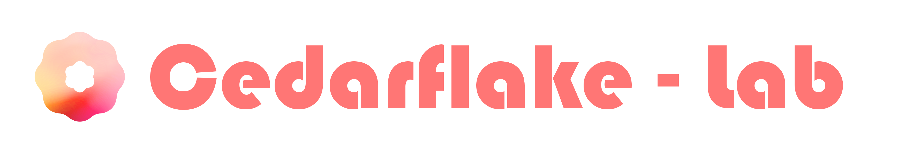

<p align="center">
  <a href="https://test.i0c.cc/">
    
  </a>
</p>

#

Personal monorepo for apps, packages, local Python projects, and assorted experiments.

## Workspaces

| Path                                 | Project                                                                        | Live                                          |
| ------------------------------------ | ------------------------------------------------------------------------------ | --------------------------------------------- |
| `apps/copilot-task`                  | Vite/React AI Agent preview site.                                              | [3kf1.test.i0c.cc](https://3kf1.test.i0c.cc/) |
| `apps/focus-orb-demo`                | Demo app for the Focus Orb package.                                            | —                                             |
| `apps/landing`                       | Landing page for the Cedarflake Lab project index.                             | [test.i0c.cc](https://test.i0c.cc/)           |
| `apps/liminal-drift`                 | Vite/React game project.                                                       | [4po7.test.i0c.cc](https://4po7.test.i0c.cc/) |
| `apps/maimai-transition`             | Vite/React transition experience.                                              | [7gkp.test.i0c.cc](https://7gkp.test.i0c.cc/) |
| `apps/personal-email`                | React Email templates and mail scripts.                                        | —                                             |
| `apps/shika`                         | Single-owner personal status app with explicit private and public projections. | —                                             |
| `apps/youtube-auto-resume-extension` | Chromium Manifest V3 YouTube playback assistant.                               | —                                             |
| `packages/*`                         | Reusable frontend packages.                                                    | —                                             |
| `workbench/*`                        | Local Python utilities and small projects.                                     | —                                             |
| `others/*`                           | Others.                                                                        | —                                             |

## Related repositories

- [InFalsusTouch](https://github.com/Cedarflake/InFalsusTouch): an unofficial Android USB touch controller for the PC rhythm game In Falsus, with streamed gameplay, six touch keys, Field control, and multi-device co-op. [Download the preview](https://github.com/Cedarflake/InFalsusTouch/releases/tag/v0.5.0-preview.1).

InFalsusTouch is maintained in its own repository and does not currently declare a reuse license.

## Commands

```bash
pnpm install
pnpm check
pnpm build
pnpm dev:landing
pnpm dev:shika
pnpm dev:focus-orb
pnpm render:email
```

Use `pnpm --filter <package-name> <script>` for project-specific frontend/package commands.

`pnpm audit:dependencies` audits the full pnpm workspace, including development dependencies, against the npm registry at the high severity threshold. The registry still reports `GHSA-vfj7-8cjw-p6xm` for the locally patched `braces@3.0.3`. This command recognizes that one mitigation only after checking the reviewed patch hash, all locked braces instances, and the installed package's security regression. Other high/critical advisories, missing patches, and audit errors fail the check. It does not add registry-wide ignore settings. Run `pnpm test:dependency-audit` to verify this gate. Replace the local mitigation when an upstream fix is published and reviewed.

Python workbench checks:

```powershell
uvx ruff format workbench
uvx ruff check workbench
```

## Repository Maintenance

See [Repository Rules](./docs/repository-rules.md) before adding, moving, archiving, or deleting a project. The rules define when to update the landing catalog, README indexes, Live links, licenses, workspace metadata, and CI.
